# RepairFlow — Диаграммы PlantUML

## 12 диаграмм для 6 прецедентов

Для каждого прецедента:
- **Диаграмма пригодности** (Robustness-диаграмма: актёр → boundary → control → entity)
- **Диаграмма последовательности** (Sequence diagram с компонентами системы)

---

# Прецедент 1: Создание заявки на ремонт

## Диаграмма пригодности

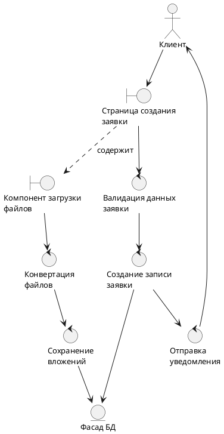

## Диаграмма последовательности

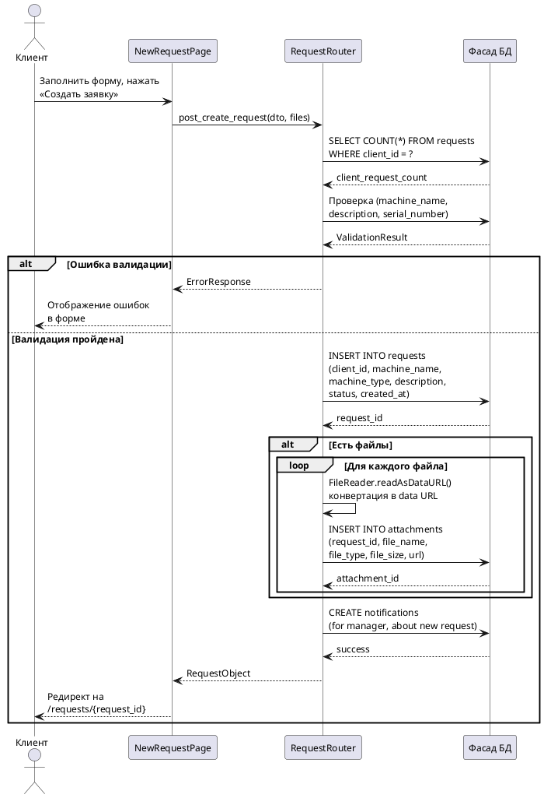

---

# Прецедент 2: Назначение техника на заявку

## Диаграмма пригодности

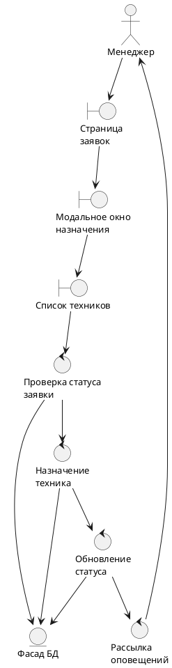

## Диаграмма последовательности

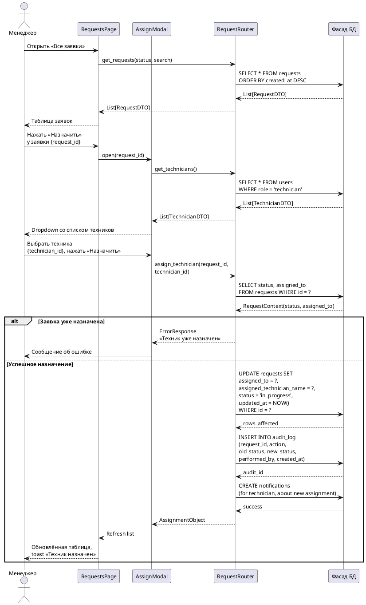

---

# Прецедент 3: Обновление статуса ремонта

## Диаграмма пригодности

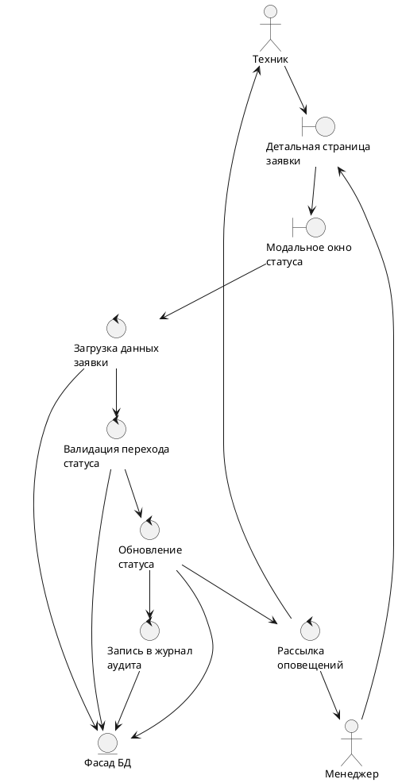

## Диаграмма последовательности 3a: Просмотр деталей заявки

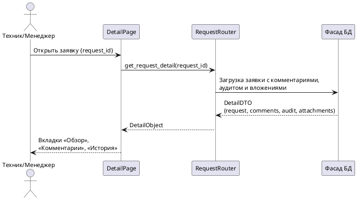

## Диаграмма последовательности 3b: Обновление статуса заявки

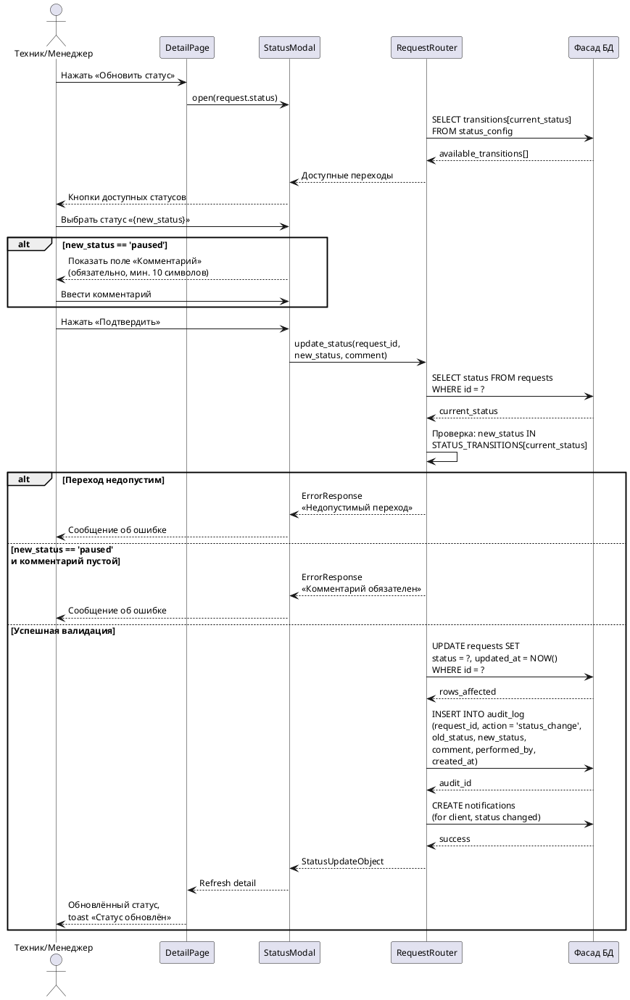

---

# Прецедент 4: Добавление комментария

## Диаграмма пригодности

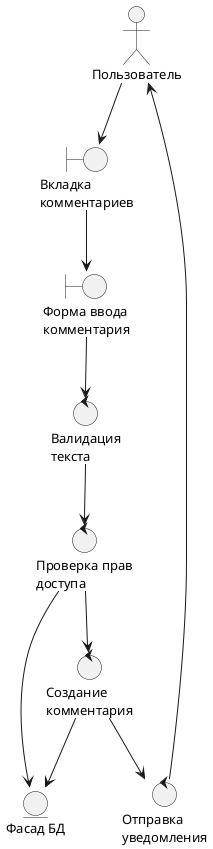

## Диаграмма последовательности

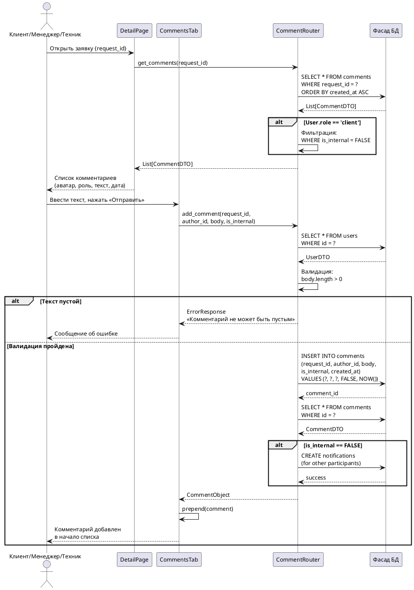

---

# Прецедент 5: Загрузка и просмотр вложений

## Диаграмма пригодности

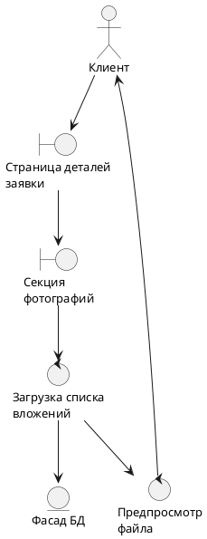

## Диаграмма последовательности

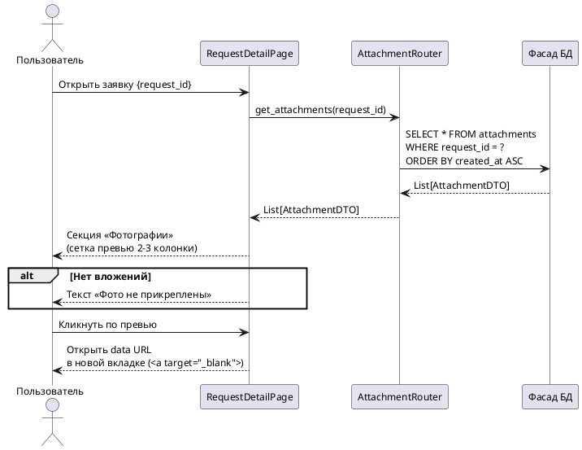

---

# Прецедент 6: Просмотр заявок с фильтрацией

## Диаграмма пригодности

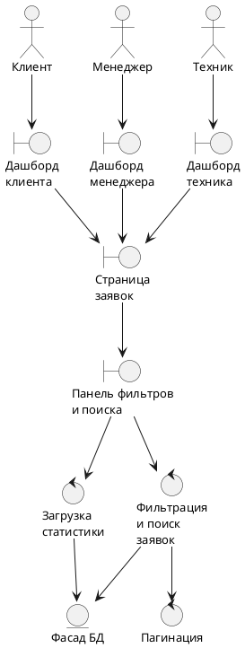

## Диаграмма последовательности

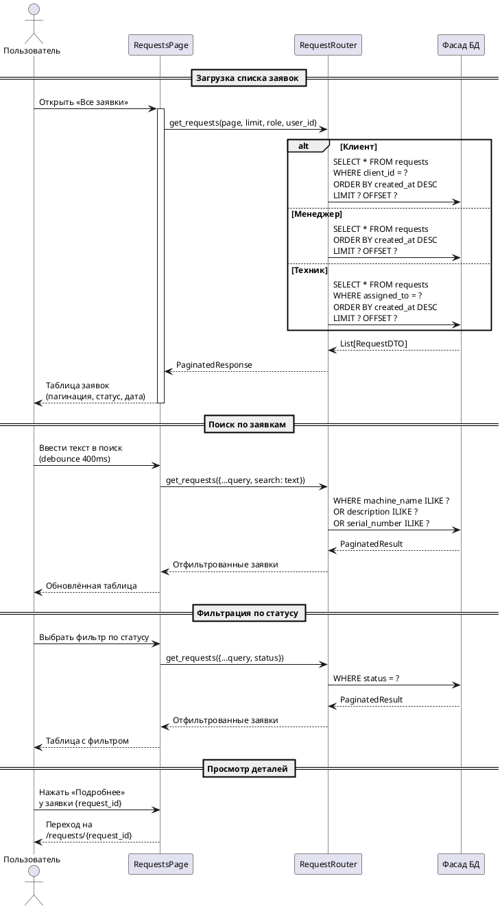

---

## Сводная таблица

| № | Прецедент | Диаграмма пригодности | Диаграмма последовательности |
|---|-----------|----------------------|------------------------------|
| 1 | Создание заявки на ремонт | `@startuml` (Robustness) | `@startuml` (Sequence) |
| 2 | Назначение техника | `@startuml` (Robustness) | `@startuml` (Sequence) |
| 3a | Просмотр деталей заявки | `@startuml` (Robustness) | `@startuml` (Sequence) |
| 3b | Обновление статуса ремонта | `@startuml` (Robustness) | `@startuml` (Sequence) |
| 4 | Добавление комментария | `@startuml` (Robustness) | `@startuml` (Sequence) |
| 5 | Загрузка вложений | `@startuml` (Robustness) | `@startuml` (Sequence) |
| 6 | Просмотр заявок с фильтрацией | `@startuml` (Robustness) | `@startuml` (Sequence) |
